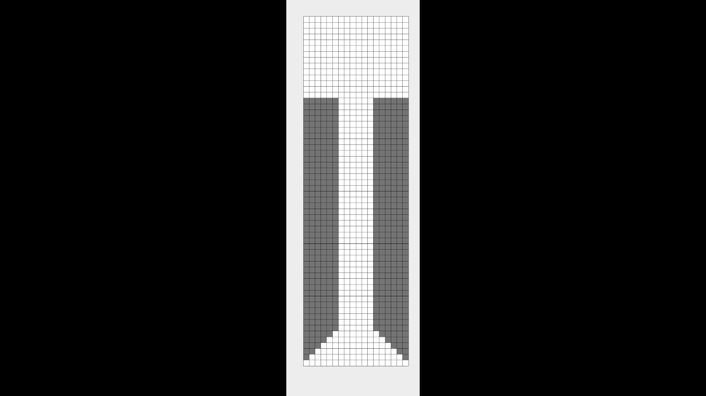
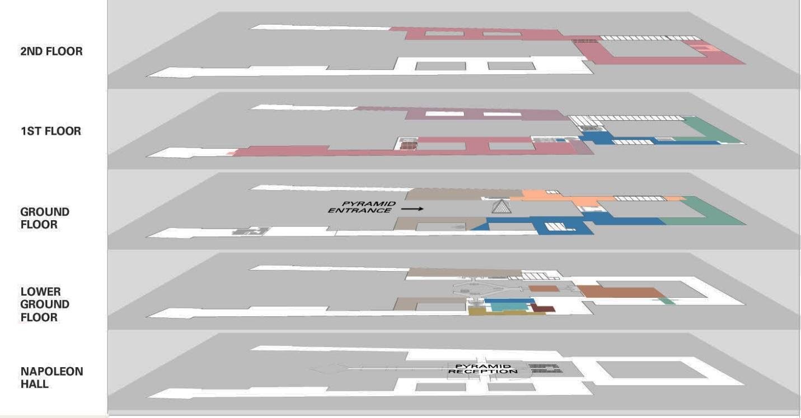
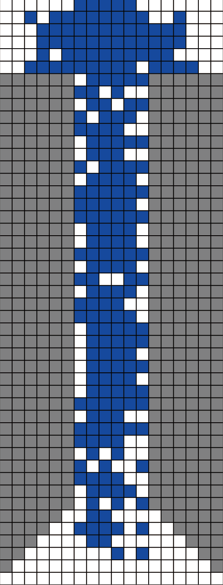

Table of Contents
=================
   * [Evacuation Demo](#evacuation-demo)
   * [A Self-adaption Cellular Automaton Model](#a-self-adaption-cellular-automaton-model)
   * [Acknowledgement](#acknowledgement)
   * [Problem Review](#problem-review)
      * [Glossary](#glossary)
   * [Basic Assumptions](#basic-assumptions)
   * [Function Implementations](#function-implementations)
      * [Canvas Drawing](#canvas-drawing)
      * [Movement](#movement)
      * [Canvas Refresh](#canvas-refresh)
   * [Additional Direction](#additional-direction)
   
# Evacuation Demo
<p align="center"></p>

# A Self-adaption Cellular Automaton Model
[](https://github.com/Hephaest/2019ICM-D/blob/master/LICENSE)
[](https://www.oracle.com/technetwork/java/javase/8u202-relnotes-5209339.html)

English | [中文](README_CN.md)

Last updated on `2019/07/18`

This project is just one part of the solutions of 2019 ICM Problem D - a self-adaption cellular automaton model to monitor visitor’s behavior in case of a stampede.
# Acknowledgement
Thanks to Dr.Zhou! He inspired me by his cellular automaton model.

I rewrote his code to fulfill the requirements of 2019 ICM Problem D.

You can find the original code at: https://github.com/MCMICM/2005MCM-B.

My code focus on the interactions between the visitors, the rules to guide the visitors to evacuation.

# Problem Review  

The increasing number of terror attacks in France requires a review of the emergency evacuation plans at many popular destinations. Your ICM team is helping to design evacuation plans at the Louvre in Paris, France. In general, the goal of evacuation is to have all occupants leave the building as quickly and safely as possible. Upon notification of a required evacuation, individuals egress to and through an optimal exit in order to empty the building as quickly as possible.

The Louvre is one of the world’s largest and most visited art museum, receiving more than 8.1 million visitors in 2017. The number of guests in the museum varies throughout the day and year, which provides challenges in planning for regular movement within the museum. The diversity of visitors -- speaking a variety of languages, groups traveling together, and disabled visitors -- makes evacuation in an emergency even more challenging.

The Louvre has five floors, two of which are underground.
<p align="center"></p>

The 380,000 exhibits located on these five floors cover approximately 72,735 square meters, with building wings as long as 480 meters or 5 city blocks. The pyramid entrance is the main and most used public entrance to the museum. However, there are also three other entrances usually reserved for groups and individuals with museum memberships: the Passage Richelieu entrance, the Carrousel du Louvre entrance, and the Portes Des Lions entrance.

Only *emergency personnel* and museum officials know the actual number of total available exit points (service doors, employee entrances, VIP entrances, emergency exits, and old secret entrances built by the monarchy, etc.). While public awareness of these exit points could provide additional strength to an evacuation plan, their use would simultaneously cause security concerns due to the lower or limited security postures at these exits compared with level of security at the four main entrances. Thus, when creating your model, your team should consider carefully when and how any additional exits might be utilized.

Your supervisor wants your ICM team to develop an emergency evacuation model that allows the museum leaders to explore a range of options to evacuate visitors from the museum, while also allowing emergency personnel to enter the building as quickly as possible. It is important to identify potential *bottlenecks* that may limit movement towards the exits. The museum emergency planners are especially interested in an adaptable model that can be designed to address a broad set of considerations and various types of potential threats. Each threat has the potential to alter or remove segments of possible routes to safety that may be essential in a single optimized route. Once developed, validate your model(s) and discuss how the Louvre would implement it.

Based on the results of your work, propose policy and procedural recommendations for emergency management of the Louvre. Include any applicable crowd management and control procedures that your team believes are necessary for the safety of the visitors. Additionally, discuss how you could adapt and implement your model(s) for other large, crowded structures.

## Glossary
- **Bottlenecks** – places where movement is dramatically slowed or even stopped.
- **Emergency personnel** – people who help in an emergency, such as guards, fire fighters, medics, ambulance crews, doctors, and police.

# Basic Assumptions
- **Queue is organized by the first-in-first-out (FIFO) queue discipline**. This queue discipline represents that the first visitor who is in a waiting queue will be the first visitor to leave the entrance.
- **The queue length is relatively invariant**. Any individual follows the general principles to go forward and does not attempt to go beyond the individual in front if visitor and the person in front of the visitor have the same running speed.
- **Each visitor runs in a single direction**. Visitors run from the inside out and no longer returns to the interior of the building.
- **The probabilities of different ages on each floor are the same**. According to the Louvre Attendance and Frequentation reports from previous 4 years, assume that the proportion of normal adults is 79%, the proportion of young children is 12%, and the proportion of inconvenient walking people (the old, the blind, some people who are visually impaired, some people
who suffer from leg disability, etc) account for 9%.
- According to the statistics, assume that the walking speed of a normal adult is 0.75 m=s, and the running speed is no more than 3 m/s, the children’s movement speed is only 70% of normal adults, and movement speed of inconvenient people is only 70% of normal adults.
- According to the statistics, assume that the flux of the Portes Des Lions entrance is 6 person per second, the flux of the Passage Richelieu entrance is 6 person per second, the flux of the Carrousel du Louvre entrance is 6 person per second, and flux of the pyramid entrance is 14 person per second.
# Function Implementations
According to the tasks, the model should follow the additional assumptions:
- The number of visitors arriving at each exit (B1) in unit time approximately obeys the Normal distribution.
- Visitors run toward the nearest exit. The visitor will try to turn left or right to avoid the collision if the visitor's current speed is large than the speed of the front visitor or the obstacle in front of him or her. In addition, the visitor also has the ability to accelerate (but cannot exceed the maximum speed rate) or decelerate the running speed and stop for some reasons.
- Obstacles appear randomly, including flames, broken exhibits, stuffs left behind by visitors. However, over a period of time, these obstacles will be removed but new obstacles appear.
- According to congregational psychology, when visitors leave the exits, they will follow the path which is selected by more than half of the people.

The whole function implementations have been divided into 3 parts: `Canvas Drawing`, `Movement`, `Canvas Refresh`.
## Canvas Drawing
There are 4 basic object in a canvas, including `walls`, `passages`, `obstacles` and `visitors`. Each object has its own color, the appearances have been achieved by the following code:
```MATLAB
function h = showPassage(passage, h, n)
%
% showPassage  To show the passage matrix as an image.
%
% Author: Hephaest
% July 18, 2019

% mark:      visitor;       empty;        wall;     obstacle;
mark  = [          1;           0;          -1;          -2];
color = [0.0 0.0 1.0; 1.0 1.0 1.0; 0.5 0.5 0.5; 1.0 0.0 0.0];

rgb = mark2color(passage, mark, color);

if ishandle(h)
    set(h,'CData',rgb)
else
    figure('position',[20, 50, 200, 700]);
    h = imagesc(rgb); 
    hold on; axis image; set(gca, 'xtick', [], 'ytick', []);
    % Draw the grid.
    [L, W] = size(passage);
    plot([0:W;0:W] + 0.5, [0;L] + 0.5, 'k', [0;W] + 0.5, [0:L;0:L] + 0.5,'k')
end
pause(n)

% -------------------------------------------------------------------------

function rgb = mark2color(mat, mark, color)
[R, G, B] = deal(zeros(size(mat)));
for i = 1:length(mark)
    R(mat==mark(i)) = color(i,1);
    G(mat==mark(i)) = color(i,2);
    B(mat==mark(i)) = color(i,3);
end
rgb = cat(3, R, G, B);
```
First of all, we need to set the boundaries. Walls are static, but the shapes of walls between entrances are different. 

The code is shown as follows:
```MATLAB
function [passage, v, time] = createPassage(E,L)
%
% createPassage    Create the empty passage matrix(no people). 
%
% Author: Hephaest
% July 18, 2019

booth_row = ceil( L / 4);
W = E * 3;
[passage, v, time] = deal(zeros(L, W));
passage(booth_row : ceil(L * 2 / 3), :) = -1;

for row = ceil(L * 2 / 3) : L
    for col = 1 : L - row
        if col > W
            break;
        end
        passage(row, col) = -1;
    end
end

passage(ceil(L * 2 / 3) : end, 2 * E : end) = -1;

for row = ceil(L*2/3) : L
    passage(row, 2 * E : W - L + row) = 0;
end

passage(booth_row : end, E + 1 : 2 * E) = 0;
passage(booth_row, E + 1 : 2 * E) = 0;
```
Secondly, we also need to create obstacles which possibly appear in everywhere at different time. 

The code is shown as follows:
```MATLAB
function [passage, flag] = newObstacle(N, passage, flag, scount, i, L)
%
% newObstacle   Produce new obstacle. 
% 
% Obstacles are distributed randomly on the passageway. 
% Suppose obstacles could be removed or changed in a period of time.
%
% Author: Hephaest
% July 18, 2019

if mod(i, scount/10) == 0       % Obstacles will be changed. 
    cnt = find(passage == -2);  % In every scount/10 time.
    passage(cnt) = 0;
    flag = 0;
end

if flag == 0
    [x, y] = find(passage(ceil( L / 3) : end - 2, :) == 0);
    x = x + ceil(L / 3) - 1;
    [row, col] = size([x, y])
    obstacle = [x, y];
    rand_num = ceil(rand * N);          % The number of obstacles is random.
    select = randperm(row, rand_num);   % The positions of obstacles are random.
    obs = obstacle(select, :);
    [r, l] = size(obstacle(select, :));    
    for i = 1:r
            passage(obs(i, 1), obs(i, 2)) = -2;
    end
    flag = 1;
end

end
```
Thirdly, the number of arriving people should follow the normal distribution. However, due to the constraint of the maximum entrances, if the number of arriving people exceeds the maximum entries, the number of arriving people is equal to the maximum entrances.

The code is shown as follows:
```MATLAB
function [passage, v] = newPeople(count, mu, pop, passage, v, vmax)
%
% newPeople   Produce new visitors. 
%
% Author: Hephaest
% July 18, 2019

if count == 0.1
    count = 0;
end
% Find the empty space of the entrance to simulate the coming visitors.
bottom = find(passage(end,:) == 0);
n  = length(bottom); % The number of available space from botom.
% The number of new visitors must be an integer and not exceeding the number of available spaces.
min_num_bottom = min(round((normpdf(count, mu, 1) + 0.1)  *  pop / 2), n); 

if count < pop
    x_bottom = randperm(n, min_num_bottom);
    
    % Based on the analogy of the 2018 Louvre Attendance report, the
    % probability of adults in the Louvre museum is 83%, the probability of
    % young people is 12%, and the rest 5% is for old people or disabilities.

    proNormal = 0.83;
    proYoung = 0.12;
    proDisable = 0.05;

    rand_num = rand;

    if rand_num >= proNormal + proYoung
        v(end, bottom(x_bottom)) = vmax + 2;
    elseif rand_num >= proNormal
        v(end, bottom(x_bottom)) = vmax + 1;
    else
        v(end, bottom(x_bottom)) = vmax;
    end
    passage(end, bottom(x_bottom)) = 1;
end
```
## Movement
According to the above assumptions, the movement of the visitor can be resolved into two actions: switch the position and move forward. As for switching, the visitor needs to check whether there is a space for the movement otherwise stop in place waiting for the next chance. In terms of moving forward, the only thing we cannot ensure is the running speed of the visitor. However, we can use mathematical methods to de some reasonable assumptions.

Hence, the code of switching is shown as follows:
```MATLAB
function [passage, v, time] = switchPos(passage, v, E, L, time)
%
% switchPos  Human respondence simulations.
%  
% The visitors will try to avoid the obstacles. Visitors randomly chooses 
% right or left direction. If that intended direction is blocked, visitor
% will stop running for seconds to find another way if both directions 
% are unavailable. 
%
% Author: Hephaest
% July 18, 2019

booth_row = ceil(L/4 );
[row, col] = find(passage==1);

for k = 1 : length(row)
    i = row(k); j = col(k);
    dj = randsample([-1,1], 1);
    flag = 0;
    if v(i,j) == 0
        continue;
    end
    
    if i >= booth_row
        
        % First corner.
        for distance = 1 : -v(i,j)
            if passage(i - distance, j) ~=0
                if  j <= 3 * E / 2 && passage(i, j + 1) == 0 && passage(i + v(i,j), j + 1) == 0
                    [passage, v, time] = move(passage, v, time, i, j, 0, 1);
                elseif j <= 3 * E / 2 && passage(i, j - v(i,j)) == 0 && passage(i + v(i,j), j - v(i,j)) == 0
                    [passage, v, time] = move(passage, v, time, i, j, 0, - v(i,j));
                elseif j > 3 * E / 2 && passage(i, j - 1) == 0 && passage(i + v(i,j), j - 1) == 0
                    [passage, v, time] = move(passage, v, time, i, j, 0, -1);
                elseif j > 3 * E / 2 && passage(i, j + v(i,j)) == 0 && passage(i + v(i,j), j + v(i,j)) == 0
                     [passage, v, time] = move(passage, v, time, i, j, 0, v(i,j));
                else
                    v(i,j)= 0;
                end
                flag = 1;
                break;
            end
        end
        
        if flag == 0 && passage(i-1,j) ~= 0 && passage(i, j - 1) ~= 0 && passage(i, j + 1) ~= 0
            v(i,j)=0;
            continue;
        end
    else
        
        [newRow, newCol] = find(passage==1);
        % Move left or right.
        leftCount = find(newCol <= 3 * E /2 & newRow <booth_row);
        rightCount = find(newCol > 3 * E /2 & newRow <booth_row);
        if i < booth_row && i > 0 && j < 3 * E && j > 0
            if length(leftCount) > length(rightCount)
                if passage(i, j - 1)==0
                    [passage, v, time] = move(passage, v, time, i, j, 0, -1);
                end
            elseif length(leftCount) < length(rightCount)
                if passage(i, j + 1)==0
                    [passage, v, time] = move(passage, v, time, i, j, 0, 1);
                end
            else
                if passage(i,j+dj)==0
                    [passage, v, time] = move(passage, v, time, i, j, 0, +dj);
                elseif passage(i,j-dj)==0 
                    [passage, v, time] = move(passage, v, time, i, j, 0, -dj);
                end
            end
        end
        
    end
    
end
%---------------------------------------------------------------------
function [passage, v, time] = move(passage, v, time, i, j, di, dj)
% move visitor from (i,j) to (i+di,j+dj).
passage(i+di,j+dj) =         1;          passage(i,j) = 0;
v(i+di,j+dj)       =    v(i,j);          v(i,j)       = 0;
time(i+di,j+dj)    = time(i,j);          time(i,j)    = 0;
```
The code of moving forward is shown as follows:
```MATLAB
function [passage, v, time] = movement(passage, v, time, vMax, L)
% 
% move_forward   People move forward governed by NS algorithm:
%
% 1. Acceleration. If the people have a chance to speed up without hitting 
% the limit speed vMax, vn = vn + 1. However, this condition is not
% suitable for the people whose velocity is 0.
%
% 2. Collision prevention. If the distance between the people and the people 
% ahead of him, dn is less than or equal to vn , then vn = dn - 1.
%
% 3. Conditional slowing. peoples run slow to avoid obstacles. 
% With some probability pbrake, vn = vn - 1. 
%
% 4. People movement. The peoples are usually moved by their velocities.
%
% Author: Hephaest
% July 18, 2019

% Probability of acceleration.
probac = 0.6;
% Probability of deceleration.
pbrake = 0.1;

f = find(passage == 1 & v ~= 0);
    
% Random acceleration.
k = find(rand(size(f))<probac);
select = find(mod(f(k),ceil(4/L))~=0 & mod(f(k),ceil(4/L)+1)~=0 ...
         & mod(f(k),ceil(4/L)+2)~=0 & mod(f(k),ceil(4/L)+3)~=0);
v(k(select)) = max(v(k(select))-1, vMax);

% Collision prevention.
gap = getgap(passage, vMax); 
k = find(-v(f)>gap(f));
v(f(k)) = -gap(f(k));

% Random deceleration.
k = find( rand(size(f))<pbrake );
select = find(mod(f(k),ceil(4/L))~=0 & mod(f(k),ceil(4/L)+1)~=0 ...
         & mod(f(k),ceil(4/L)+2)~=0 & mod(f(k),ceil(4/L)+3)~=0);
v(k(select)) = min(v(k(select))+1, 0);

% People movement.
passage(f) = 0;              passage(f + v(f)) = 1;
time(f+v(f)) = time(f) + 1;  time(passage~=1) = 0;
v(f+v(f)) = v(f);            v(passage~=1)=0;

% -------------------------------------------------------------------------

function gap = getgap(passage, vMax)
gap = zeros(size(passage));
[row, col] = find(passage == 1);
for k = 1 : length(row)
    i = row(k); j = col(k);
    d = passage(1 : i - 1, j);
    gap(i, j) = min(find([d ~= 0; zeros(-vMax, 1); 1])) - 1;
end
gap(1,:) = 0;
```
## Canvas Refresh
Finally, we need to refresh the canvas, this requires us to "clear" visitors who have successfully escaped from the current entrance. Besides, if the last one has successfully escaped then we need to calculate the mean cost time.

The following code is aimed to "clear" the visitor who has successfully escaped by return and reset personal attributes:
```MATLAB
function [passage, v, time, nOut, tout] = clearBoundary(passage, v, time)
%
% clear_entrance  Remove the people of the exit space.
%
% Author: Hephaest
% July 18, 2019

[L, W] = size(passage);
ind = find(passage == 1);
[row, col] = ind2sub([L,W], ind);

% Find out the running speeds of people.
% Clear the position and accumulation.

k = find((v(ind) + row <= 0) | (row < ceil( L / 4) & (col == 1 | col == W)));

nOut = length(k);       % Count the people who successfully exits.
tout = time(ind(k));    % Count the time that people successfully exits.
passage(ind(k)) = 0;    % Clear the color.
v(ind(k)) = 0;          % Remove velocity.
```
Then we can refresh and start our demo from the main function:
```MATLAB
% main.m
%
% This main script is used to simulate the situation of the emergency 
% evacuation on each entrance.
%   
% Author: Hephaest
% July 18, 2019

clear; clc
sCount = 1000;      % The maximal iterations of simulation.
N = 10;             % The maximum of obstacles.
E = 6;              % The entrance width.
vMax = -3;          % Max upward running speed.
L = 60;             % The entrance length.
flag = 0;           % Check whether obstacle exists or not.
pop = 1000;         % The total number of visitors in the current floor. 

[passage, v, time] = createPassage(E,L);

g = showPassage(passage, NaN, 0.01);  % The graphic.

tCost = [];          % Total time of evacuation.
count = 0;           % The current number of people.
eCount = 1;          % The current number of people who is in the passage.
oCount = 0;          % The total number of people who have successfully evacuated.
mu = pop / 2;        % The mu value of normal distribution.

while eCount > 0
    % Produce new obstacle.
    [passage, flag] = newObstacle(N, passage, flag, sCount, count, L);
    
    % Produce new people.
    [passage, v] = newPeople(count, mu, pop, passage, v, vMax);
    
    % Update people behavior.
    [passage, v, time] = switchPos(passage, v, E, L, time); 
    [passage, v, time] = movement(passage, v, time, vmax, L);

    % Boundary condition.
    [passage, v, time, nOut, tout] = clearBoundary(passage, v, time);
    oCount = oCount + nOut;
    
    % Passage plot.
    g = showPassage(passage, g, 0);
    
    % Some people start moving.
    [row, col] = find(v == 0);
    for k = 1: length(row)
        i = row(k); j = col(k);
        v(i, j) = ceil(rand * vmax);
    end
    
    % Visitor calculation.
    tcost = [tcost; tout];
    count = length(find(passage(:,:) == 1));
    count = count + oCount;
    eCount = length(find(passage(:,:) == 1));
    
end

g = showPassage(passage, g, 0.01);
% Display the mean cost time.
xlabel(['mean cost time = ', num2str(mean(tcost))])
```
# Additional Direction
By the way, the [Evacuation Demo](#evacuation-demo) only shows single direction evacuation (from bottom to top). In fact, two-way evacuation (from top to bottom) is also applied. Since the relevant code is very similar to the code above, I only show you the result here.

<p align="center"></p>
